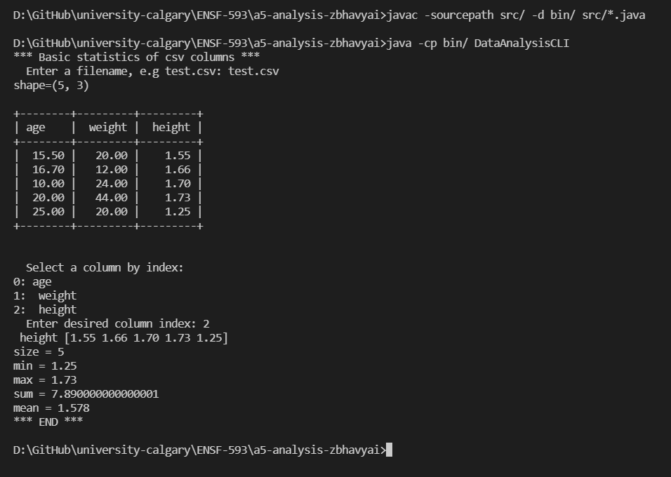
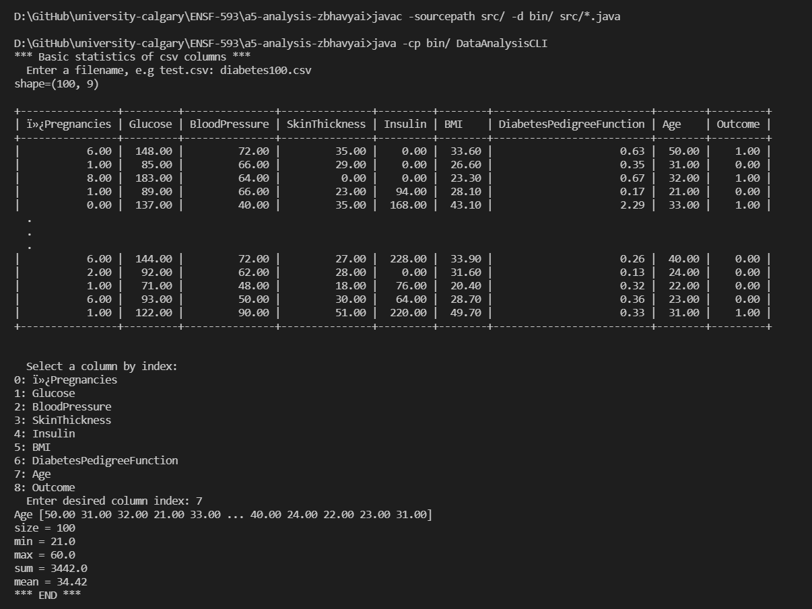

# Data Analysis report

Author: Bhavyai Gupta

## UML class diagram

## Execution and Testing

1. Analyzing column `height` in **test.csv**

   

   Verifying program output against MS Excel

   

2. Analyzing column `Age` in **diabetes100.csv**

   

   Verifying program output against MS Excel

   