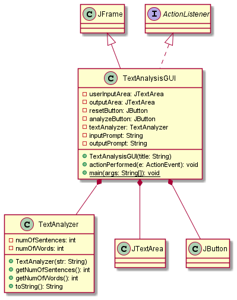
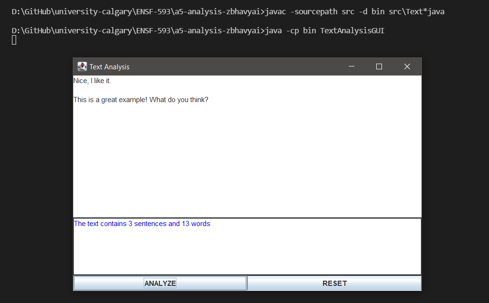
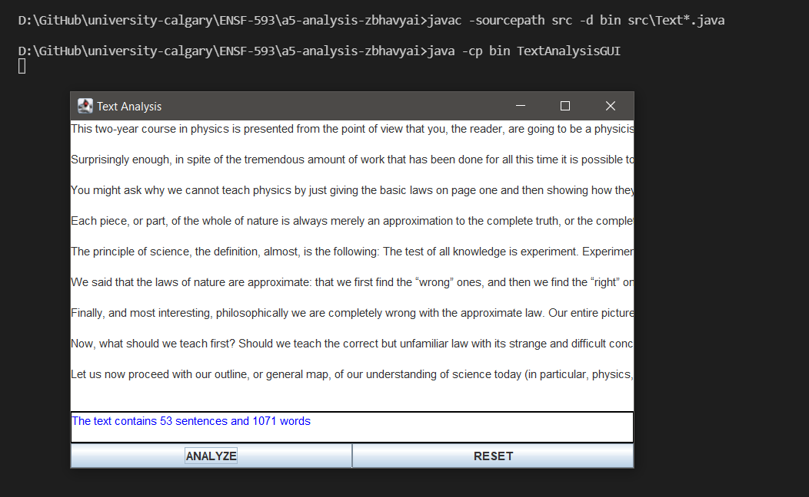
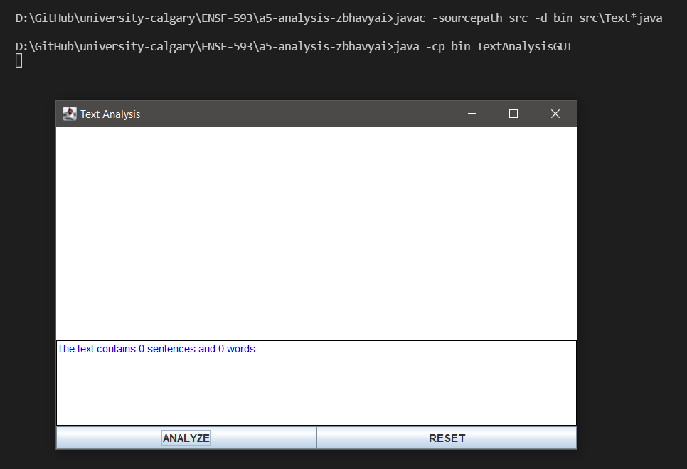
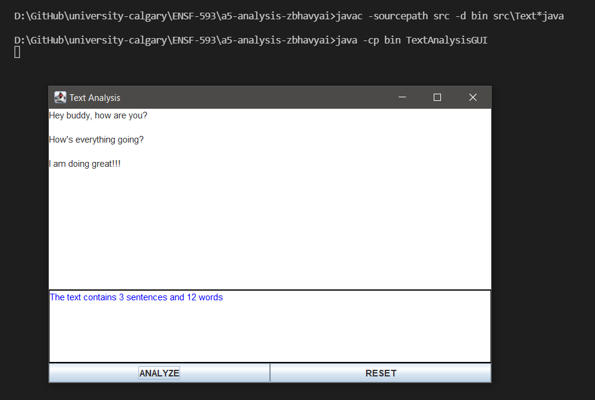

# Text Analysis report

Author: Bhavyai Gupta

## UML class diagram

## Execution and Testing

#### Execution for sample `test.txt`

#### Execution for sample `feynman.txt`

#### Custom Test. Execution for empty text

#### Custom Test. Execution for text with multiple delimiters

